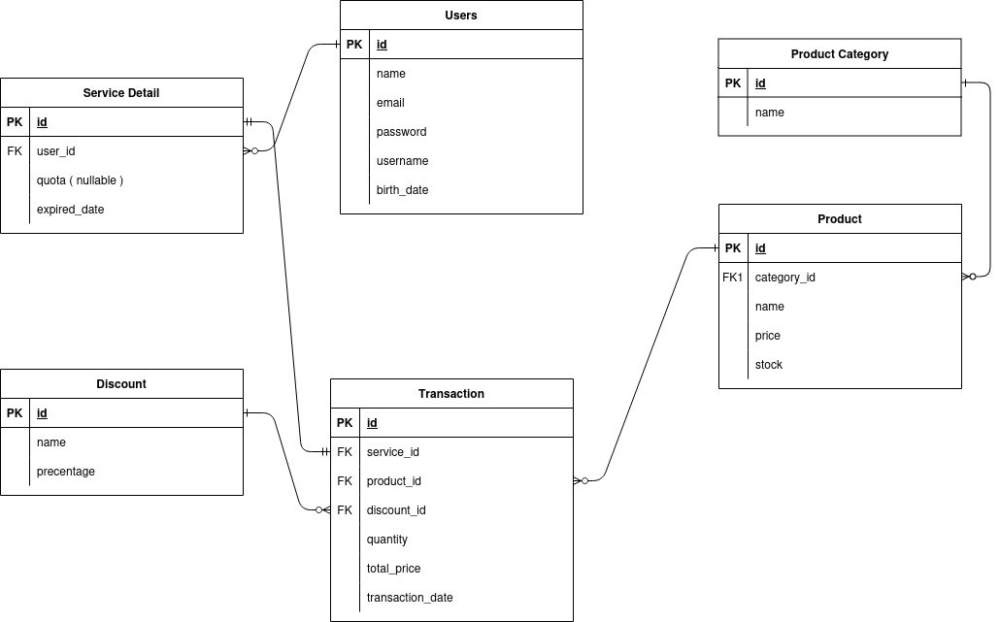
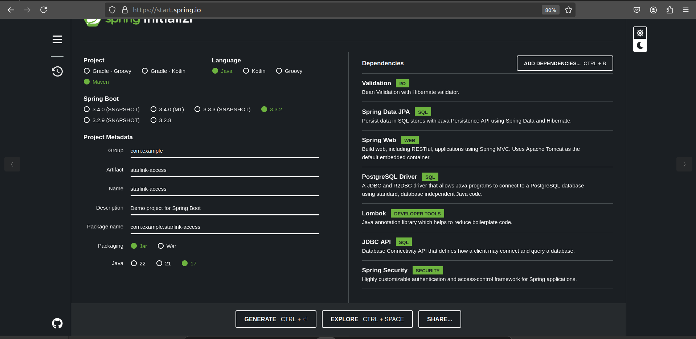
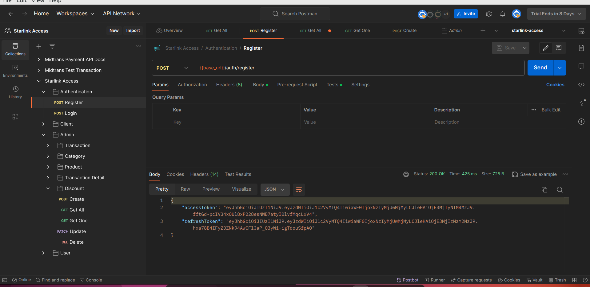
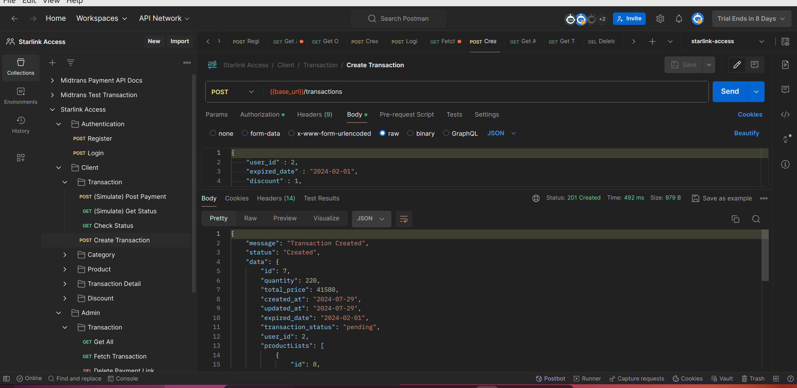
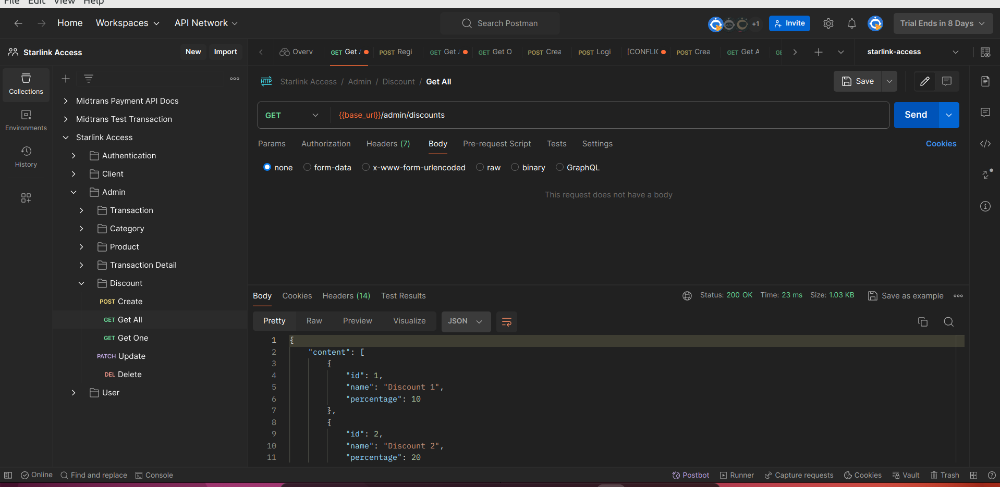
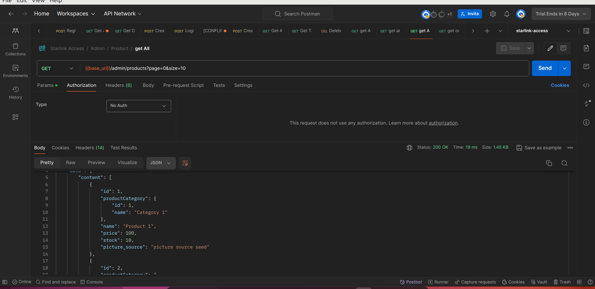

# Documentation for Starlink Access

## Overview
The Starlink Access project uses Spring Boot as a framework. You can visit https://start.spring.io to create a Spring Boot 
project. Starlink Access provides services to customers such as registration for monthly subscriptions to Starlink packages, 
purchase of Starlink antennas, and purchase of Starlink internet quota. The project is also integrated with Mitrans for payment needs.

## Diagram Database

## Project Structure
In this project, several dependencies are used, including Lombok, which facilitates writing code with annotations, JDBC API 
functions to connect to the database, Spring Data JPA functions for CRUD operations on the database, Spring Security functions for 
authentication and authorization, and PostgreSQL Driver as a database driver for PostgreSQL. The project structure is illustrated in the diagram below:

## Database
The Starlink Access application uses PostgreSQL as the main database. The database schema includes several tables:
- **User table**: Stores customer information.
- **Payment table**: Stores payment history.
- **Product table**: Stores products (consisting of antennas and quotas).
- **Transaction table**: Stores purchase transaction information.

## Security Settings
To maintain security in the application, this project uses JWT Authentication for user authentication and authorization. 
Additionally, Role-Based Access Control (RBAC) with JSON Web Tokens (JWT) is used to restrict system access based on user roles, 
ensuring each role has specific predefined access rights.

## Usage Flow

### User Registration and Authentication
***New User Registration:***
1. Users access the registration endpoint.
2. The system receives user data (name, email, password, username, birth date).
3. Passwords are encrypted before storage in the database.

***User Authentication:***
1. Users enter credential (email and password).
2. System verifies credentials against the User table.
3. if valid, system generates a JWT token.
4. JWT token is sent to the user for subsequent requests.

***Role Management:***
1. System provides two roles: admin and users.
2. User roles are determined at registration or set by admin.
3. Access to certain features is restricted based on users roles.

### Service Management
***Service Creation:***
1. Admin creates new services by filling details in the Service Detail table.
2. Information such as quota and expired_date is set for each service.

***Quota Management:***
1. System monitors user quota usage.
2. Quota is updated each time a user makes a transaction or users a service.

***Service Updates:***
1. Admin can update service details like quota or expiration date.
2. Changes are reflected in the Service Detail table.

### Product Management
***Product Categories:***
1. Admin manages product categories through the Product Category table.
2. New categories can be added, modified, or deleted.

***Product Management:***
1. Admin adds new products to the Product table.
2. Each product is linked to a specific category via category_id.
3. Product information like name, price, and stock is managed.

***Stock Updates:***
1. System updates product stock with each transaction.
2. Admin can manually update stock if necessary.

### Transaction Process
***Transaction Creation:***
1. User selects products or services to purchase.
2. System creates a new entry in the Transaction table.
3. Transaction details like service_id, product_id, quantity, and total_price are filled.

***Discount Application:***
1. System checks for applicable discounts from the Discount table.
2. If available, discount is applied and total_price is updated.

***Mitrans Payment Integration:***
1. System sends transaction details to Mitrans.
2. Mitrans processes the payment and sends confirmation.
3. System updates transaction status based on Mitrans response.

***Stock and Service Updates:***
1. After succesful payment, system updates product stock.
2. If transaction involves a service, user quota is updated in Service Detail.

### Discount Managment
***Discount Creation:***
1. Admin creates new discounts through the Discount table.
2. Details like discount name and percentage are set.

***Discount Application:***
1. System automatically applies applicable discounts during transactions.
2. Discounts can be applied to specific products or services.

### Reporting And Analysis
***Transaction Reports:***
1. Admin can access transaction reports for specific periods.
2. System aggregates data from the Transaction table to create reports.

***Service Usage Analysis:***
1. System provides service usage analysis based on Service Detail data.
2. Admin can view trends in quota usage and service expiration dates.

### Security and Maintenace
***Token Management:***
1. System regularly updates and validates JWT tokens.
2. Expired or invalid tokens are rejected by the system.

***Sensitive Data Encryption***
1. Sensitive data like passwords are encrypted before database storage.

***Login and Auditing:***
1. System logs all significant activites for auditing pruposes.
2. Logs can be accessed by admin for monitoring and troubleshooting.

### API Testing with Posman
***Endpoint Collection:***
1. All API endpoints are documented in a Postman collection.
2. Collection includes endpoints for authentication, product management, transactions.

- Register In Postman

- Login In Postman

- Transaction Process In Postman

- Discount In Postman

- Product & Product Category In Postman

***Test Scenarios:***
1. Test scenarios are created for each main application feature.
2. Testing covers positive and negative cases to ensure system robustness.

***Test Automation:***
1. Postman test scripts are created for API testing automation.
2. Automated tests are run periodically to ensure system integrity.
